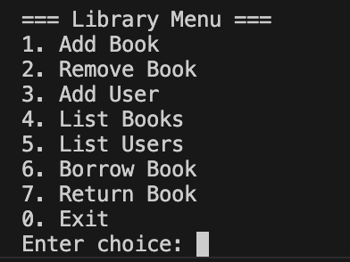

# 📚 Library Management System (C++ OOP Project)

[](LICENSE) 
 
 


This is a **console-based Library Management System** implemented in **C++** using **Object‑Oriented Programming (OOP)** principles.  
It allows the library admin to **add/remove books**, **register users**, **borrow/return books**, and **persist data** in text files so that information is retained across sessions.

---

## ✨ Features

✅ Add, remove, and list books  
✅ Add and list users  
✅ Borrow and return books (with borrowing limits and unique ISBN checks)  
✅ Track multiple copies of the same book  
✅ Data persistence using text files (`books.txt`, `users.txt`, `borrowed.txt`)  
✅ Prevent duplicate borrow of the same book by the same user  
✅ Automatic file creation if files don’t exist

---

## 📌 Library Menu

Below is a sample of the interactive menu:



---

## 📂 Files

- **`main.cpp`** → Main source code implementing the system  
- **`books.txt`** → Book records (title, author, ISBN, quantity)  
- **`users.txt`** → User records (name, ID, user type, borrow limit)  
- **`borrowed.txt`** → Borrowed book records (user ID, ISBN)

---

## 🚀 Installation & Usage

### 1️⃣ Clone the Repository
```bash
git clone https://github.com/mayankbansal76588/Library_Manager.git
cd Library_Manager
```

---
## ⚡️ Compilation and Run Instructions

### ✅ 1. Compile the Project
```bash
g++ main.cpp Book.cpp User.cpp LibraryManager.cpp -o library
```
### ✅ 2. Run the program
```bash
./library
```

